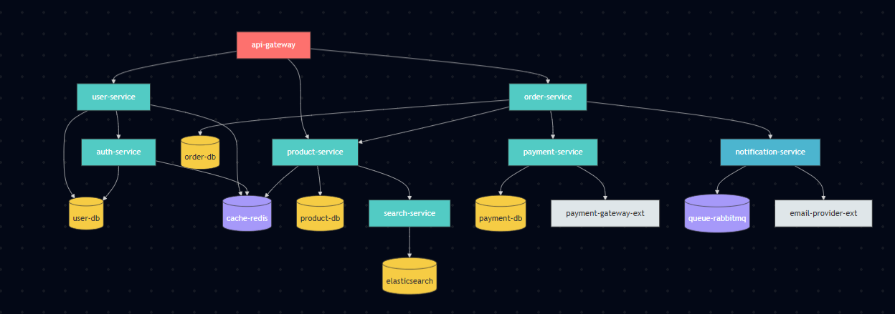

#  Incident Response & Root Cause Analysis OpenEnv

A realistic **Site Reliability Engineering (SRE)** environment where an AI agent performs **production incident response and root cause analysis** on a simulated **18-service microservices architecture**.

This is the first AI agent benchmark for incident response - a critical workflow that costs organizations [$4.4M/year on average](https://www.pagerduty.com/resources/reports/digital-operations/) and has **no existing evaluation environment** in the RL/agent community.

---

##  Why This Environment?

| Gap | Evidence |
|-----|----------|
| **No existing benchmark** | Surveyed [Awesome-LLM-Agent-Benchmarks](https://github.com/supernalintelligence/Awesome-General-Agents-Benchmark), [SWE-bench](https://www.swebench.com/), [WebArena](https://webarena.dev/), [Tau-bench](https://github.com/sierra-research/tau-bench) - none cover incident response |
| **Massive real-world cost** | $4.4M/year per org ([PagerDuty 2023](https://www.pagerduty.com/resources/reports/digital-operations/)), 62% of incidents require manual investigation ([IOFM](https://www.iofm.com/)) |
| **Requires complex reasoning** | Temporal reasoning, causal inference, multi-source evidence synthesis, decision-making under uncertainty |
| **Every tech company needs it** | SRE/DevOps is a $30B+ market. Every company with production systems has on-call engineers |

---

## ️ How It Works

The agent receives a **production alert** and must navigate through:

 ALERT →  TRIAGE →  INVESTIGATE →  DIAGNOSE →  REMEDIATE → RESOLVED


### System Architecture (18 services)




Each service has realistic:
- **Health status** (healthy / degraded / down)
- **Dependencies** (upstream and downstream)
- **Metrics** (CPU, memory, latency, error rate - with temporal patterns)
- **Logs** (structured, with realistic error messages)
- **Deployment history** (with changelogs)
- **Configuration changes** (with diffs)

---

##  Observation Space

| Field | Type | Description |
|-------|------|-------------|
| `alert` | object | Triggering alert: service, metric, condition, current value, threshold |
| `system_topology` | object | Full 18-service dependency graph with live health status |
| `queried_evidence` | array | All collected evidence: log entries, metric time-series, deployment records, config diffs, diagnostic results |
| `active_hypotheses` | array | Agent's working hypotheses about root cause |
| `incident_timeline` | array | Chronological record of all actions taken and their outcomes |
| `current_phase` | enum | `triage` → `investigation` → `diagnosis` → `remediation` → `resolved` / `escalated` |
| `affected_services` | array | Services discovered to be impacted |
| `severity_level` | string | Assessed severity: sev1 (critical) through sev4 (low) |
| `identified_root_cause` | object | Declared root cause (null until identified) |
| `remediation_applied` | object | Applied fix (null until remediated) |
| `step_number` / `max_steps` | int | Current progress and budget |

---

##  Action Space (16 actions)

### Triage
| Action | Parameters | Description |
|--------|-----------|-------------|
| `assess_severity` | `{assessed_severity: sev1-sev4, justification}` | Classify incident severity |

### Investigation
| Action | Parameters | Description |
|--------|-----------|-------------|
| `query_logs` | `{service, level_filter, time_range_minutes, search_pattern}` | Retrieve structured log entries |
| `query_metrics` | `{service, metric_name, time_range_minutes}` | Get time-series data (CPU, memory, latency, error_rate, request_rate) |
| `check_deployments` | `{service, time_range_hours}` | List recent deployments with changelogs |
| `check_config_changes` | `{service, time_range_hours}` | List recent configuration changes with diffs |
| `run_diagnostic` | `{service, check_type}` | Run checks: connectivity, health, resources, dependencies, dns, certificates |

### Diagnosis
| Action | Parameters | Description |
|--------|-----------|-------------|
| `form_hypothesis` | `{hypothesis, root_cause_category, suspected_service, confidence, supporting_evidence}` | Form a working hypothesis |
| `test_hypothesis` | `{hypothesis_index, test_action}` | Test an existing hypothesis against evidence |
| `identify_root_cause` | `{root_cause_category, root_cause_service, root_cause_description, evidence_summary, confidence}` | Declare the root cause |

### Remediation
| Action | Parameters | Description |
|--------|-----------|-------------|
| `remediate_rollback` | `{service, reason}` | Roll back a deployment |
| `remediate_scale` | `{service, target_replicas, reason}` | Scale up a service |
| `remediate_restart` | `{service, reason}` | Restart a service |
| `remediate_config_fix` | `{service, parameter, new_value, reason}` | Revert a configuration change |
| `remediate_hotfix` | `{service, description, reason}` | Deploy a targeted code fix |
| `escalate` | `{target_team, reason, summary}` | Escalate to another team |

### Other
| Action | Parameters | Description |
|--------|-----------|-------------|
| `update_status_page` | `{status, message}` | Update public status page |

---

##  Tasks (Easy → Medium → Hard)

### Task 1: Single Service Outage (Easy, max 15 steps)

**Scenario**: A single service has a clear error visible in logs (NullPointerException, OOM, etc.)

**What the agent must do**: Find the failing service → read the error → identify the cause → apply the fix

**No red herrings.** Straightforward causal chain.

**Root causes**: bad deployment, resource exhaustion

**Baseline score**: ~0.85

---

### Task 2: Cascading Service Failure (Medium, max 20 steps)

**Scenario**: A failure in one service causes cascading issues across 2-4 dependent services. The alert fires on a **downstream symptom**, not the root cause.

**What the agent must do**: Correlate symptoms across services → trace the dependency chain back to origin → distinguish symptoms from root cause → remediate at the correct point

**1-2 red herring clues**: coincidental deployments, symptomatic metric changes

**Root causes**: database issues, config changes, external dependency failures

**Baseline score**: ~0.29

---

### Task 3: Subtle Performance Degradation (Hard, max 25 steps)

**Scenario**: A deployment or config change introduces a subtle issue with **actively misleading symptoms**:
- CPU spikes from **catastrophic regex backtracking** look like traffic problems
- Memory growth from **connection pool leaks** look like database issues
- **DNS failures** look like application bugs
- Redis **cache policy misconfiguration** causes widespread failures with a coincidental deploy as red herring
- **Certificate expiry** looks like a deployment issue

**Multiple strong red herrings.** Requires correlating deployment/config timestamps with metric change points.

**Root causes**: catastrophic regex, connection pool leaks, cache policy changes, certificate expiry, intermittent DNS

**Baseline score**: ~0.44

---

##  Reward Function

**Multi-component reward with dense signal at every step:**

| Component | Weight | How It Works |
|-----------|--------|-------------|
| **Triage accuracy** | 15% | Correct severity gets full credit. Off-by-one partial credit. |
| **Investigation quality** | 25% | **Information-value scoring**: investigating the root cause service = +0.08, affected service = +0.04, unrelated = +0.01. Bonus for checking relevant evidence type (deployments for deploy issues, configs for config issues). |
| **Diagnosis correctness** | 30% | Both category + service correct = 1.0. Category only = 0.4. Service only = 0.3. Wrong = 0.0. |
| **Remediation** | 20% | Correct action + correct target = 1.0. Right action/wrong target = 0.5. Right target/wrong action = 0.3. |
| **Efficiency** | 10% | Fewer steps = higher bonus. |

### Penalties
| Behavior | Penalty |
|----------|---------|
| Repeated identical action | -0.06 |
| Invalid action for current state | -0.08 |
| Remediating without diagnosing first | -0.10 |

### Key Design Property
The **information-value** reward for investigation creates a natural exploration incentive - the agent is rewarded more for investigating services closer to the actual root cause, creating a gradient toward the correct diagnosis without giving away the answer.

---

##  Baseline Scores

### Rule-Based Agent (deterministic, server-side)

| Task | Difficulty | Score | Strategy |
|------|-----------|-------|----------|
| Single Service Outage | Easy | **0.8525** | Fixed protocol: severity → logs → deploys → configs → diagnose → fix |
| Cascading Failure | Medium | **0.2940** | Same protocol struggles with upstream tracing |
| Subtle Degradation | Hard | **0.4449** | Sometimes gets lucky with heuristics |

### LLM Agent (via OpenAI-compatible client)

| Task | Difficulty | Score | Notes |
|------|-----------|-------|-------|
| Single Service Outage | Easy | **~0.55–0.75** | Depends on model size |
| Cascading Failure | Medium | **~0.25–0.40** | Needs to trace dependencies |
| Subtle Degradation | Hard | **~0.20–0.35** | Red herrings genuinely challenging |

*Hard task challenges frontier models - misleading symptoms require careful temporal reasoning that current LLMs struggle with.*

---

##  API Endpoints

- `GET /` - Environment info and status
- `GET /health` - Health check (returns 200)
- `POST /reset` - Reset environment: {"task_id": "...", "seed": 1001}
- `POST /step` - Execute action: {"action_type": "...", "parameters": {...}}
- `GET /state` - Full internal state (includes ground truth)
- `GET /tasks` - List all tasks with action schemas
- `GET /grader` - Grade current episode (0.0–1.0)
- `GET /baseline` - Run deterministic baseline on all 3 tasks


### Example Usage

```bash
# Reset
curl -X POST https://the-m3chanic-vajra-meta-hackathon.hf.space/reset \
  -H "Content-Type: application/json" \
  -d '{"task_id": "easy_single_service_outage", "seed": 1001}'

# Assess severity
curl -X POST https://the-m3chanic-vajra-meta-hackathon.hf.space/step \
  -H "Content-Type: application/json" \
  -d '{"action_type": "assess_severity", "parameters": {"assessed_severity": "sev2", "justification": "high error rate on order-service"}}'

# Query logs
curl -X POST https://the-m3chanic-vajra-meta-hackathon.hf.space/step \
  -H "Content-Type: application/json" \
  -d '{"action_type": "query_logs", "parameters": {"service": "order-service", "level_filter": "ERROR", "time_range_minutes": 30}}'

# Identify root cause
curl -X POST https://the-m3chanic-vajra-meta-hackathon.hf.space/step \
  -H "Content-Type: application/json" \
  -d '{"action_type": "identify_root_cause", "parameters": {"root_cause_category": "bad_deployment", "root_cause_service": "order-service", "root_cause_description": "NPE in new deployment", "evidence_summary": ["Error logs show NPE", "Recent deploy found"], "confidence": 0.9}}'

# Fix it
curl -X POST https://the-m3chanic-vajra-meta-hackathon.hf.space/step \
  -H "Content-Type: application/json" \
  -d '{"action_type": "remediate_rollback", "parameters": {"service": "order-service", "reason": "Rolling back bad deployment"}}'

# Check score
curl https://the-m3chanic-vajra-meta-hackathon.hf.space/grader
```

## ️Setup
```bash
docker build -t incident-rca-env .
docker run -p 7860:7860 incident-rca-env
```

**Local**
```bash
pip install -r requirements.txt
python app.py
```

## Run Baseline
```
export API_BASE_URL=https://router.huggingface.co/v1
export MODEL_NAME=Qwen/Qwen2.5-72B-Instruct
export HF_TOKEN=HF_TOKEN_HERE
export ENV_URL=https://the-m3chanic-vajra-meta-hackathon.hf.space

python inference.py


# To run tests locally
export API_BASE_URL=http://localhost:11434/v1
export MODEL_NAME=llama3.2
export HF_TOKEN=ollama
export ENV_URL=http://localhost:7860
python inference.py
```

## Run Tests
```
python -m pytest tests/ -v
```

## Design Decisions & Novelty
**First-of-its-Kind**

No existing benchmark in the AI agent ecosystem covers incident response. This fills a genuine gap confirmed by surveying all major agent benchmark repositories.

**Information-Theoretic Reward Design**

Investigation actions scored by information value relative to root cause — investigating the actual problem service gives 8x more reward than random services. This creates a natural gradient toward efficient diagnosis.

**Red Herring Mechanics**

Medium and hard scenarios include deliberately misleading clues: Coincidental deployments that happened near the incident time

**Symptomatic metric changes on downstream services**

Normal-looking metrics on the actual root cause service
These test whether agents can distinguish correlation from causation — a fundamental challenge in real-world incident response.

**Realistic Topology**

18-service architecture with realistic dependency chains, metric patterns (with temporal anomaly injection), structured log formats, deployment changelogs, and configuration audit trails modeled after production microservices systems.

**Difficulty Calibration**

- Easy: Alert service IS the root cause. Logs clearly show error. One investigation reveals answer.
- Medium: Alert service is a SYMPTOM. Root cause is upstream. Must trace dependencies. 1-2 red herrings.
- Hard: Root cause has MISLEADING symptoms. CPU spike isn't traffic — it's regex. Memory growth isn't leak — it's cache policy. Multiple strong red herrings. Requires timestamp correlation.


## References

- PagerDuty State of Digital Operations 2023 — incident cost data
- Google SRE Book — incident response best practices
- Awesome-LLM-Agent-Benchmarks — confirmed no existing RCA benchmark
- SWE-bench , WebArena , Tau-bench — existing benchmarks in other domains